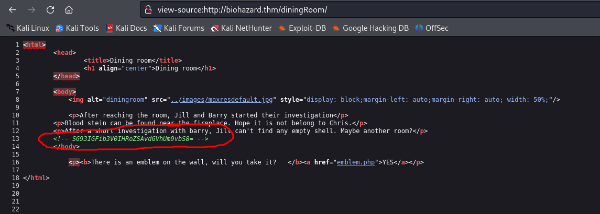

# Biohazard

**Here is my findings:**<br>
<br>
<br>
<br>
<br>
<br>
<br>
<hr>

`ffuf -w /usr/share/wordlists/dirb/big.txt -u http://biohazard.thm/FUZZ -c -t 200`<br>
<br>
<br>
<br>

crest1: RlRQIHVzZXI6IG
crest2: h1bnRlciwgRlRQIHBh
crest3: c3M6IHlvdV9jYW50X2h
crest4: pZGVfZm9yZXZlcg==
RlRQIHVzZXI6IGh1bnRlciwgRlRQIHBhc3M6IHlvdV9jYW50X2hpZGVfZm9yZXZlcg==

```
FTP user: hunter, FTP pass: you_cant_hide_forever
```

```
key1: cGxhbnQ0Ml9jYW
key2: 5fYmVfZGVzdHJveV9
key3: 3aXRoX3Zqb2x0

cGxhbnQ0Ml9jYW5fYmVfZGVzdHJveV93aXRoX3Zqb2x0
plant42_can_be_destroy_with_vjolt
```
<hr>
```
SSH
umbrella_guest:T_virus_rules
weasker login password, stars_members_are_my_guinea_pig
```