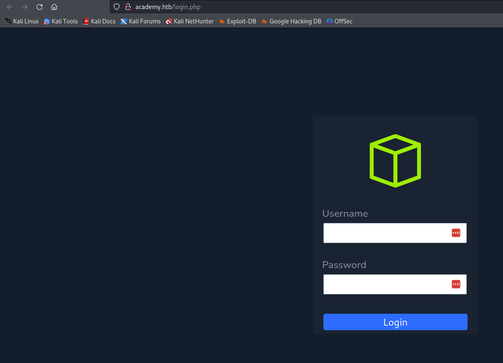
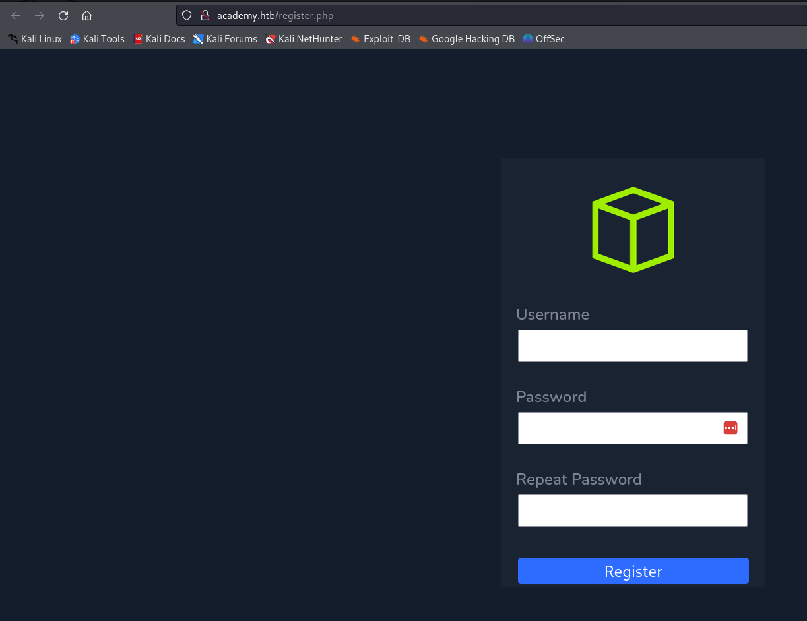
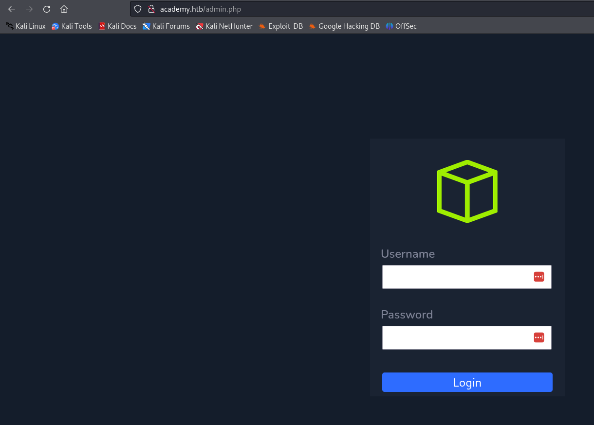
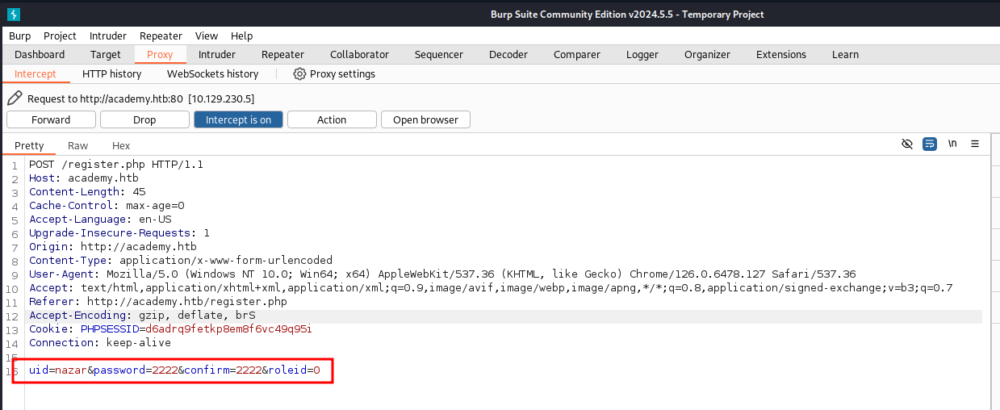
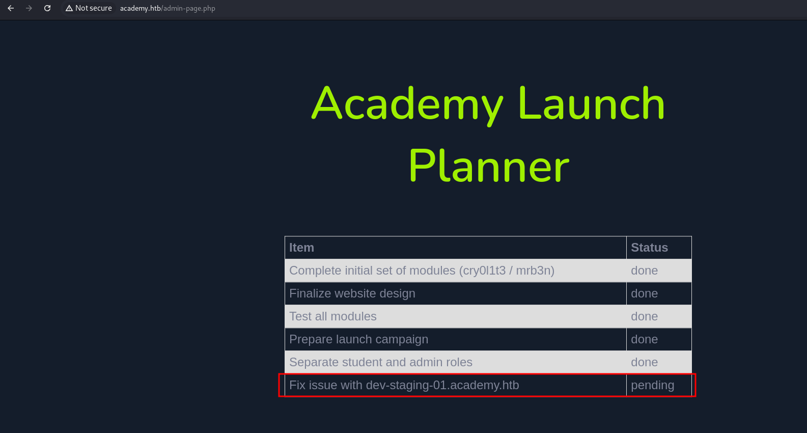

# Academy
academy.htb

## Nmap Scans
```
sudo nmap -p- --min-rate=10000 academy.htb

PORT      STATE SERVICE
22/tcp    open  ssh
80/tcp    open  http
33060/tcp open  mysqlx

```





## I created a random user


## admin.php
There is an admin login page that looks just like the default login page. However, the new user doesn't work.


## BurpSuite
I opened BurpSuite and decided to go through different pages and see what I can do.
Later on I found something interesting on the register page.


## Admin Role
I set `roleid` to `1` than went to the `admin.php` and got in.


## Subdomain
That's where I found a subdomain.

It looks like a page where we can see all the logs.
Discovering a little bit more I realized that it was the `laravel` framework. Than I found an exploit `CVE-2018-15133` and used it to get a shell.

## User Flag
Reading this file: `/var/www/html/academy/.env` I found a password for user `cry0l1t3` and sshed into it.
Interesting that the user is part of group `adm`.

## Root
In order to, not to spend too much time I used the hint and found that I had to read the audit logs. Using a tool called: `aureport` and the next command:
```
aureport --tty
```
I found a password to user `mrb3n`

Then, using `sudo -l` I found that the user can execute `composer` as a root. Than I found how to exploit it to get root.
https://gtfobins.github.io/gtfobins/composer/#sudo

