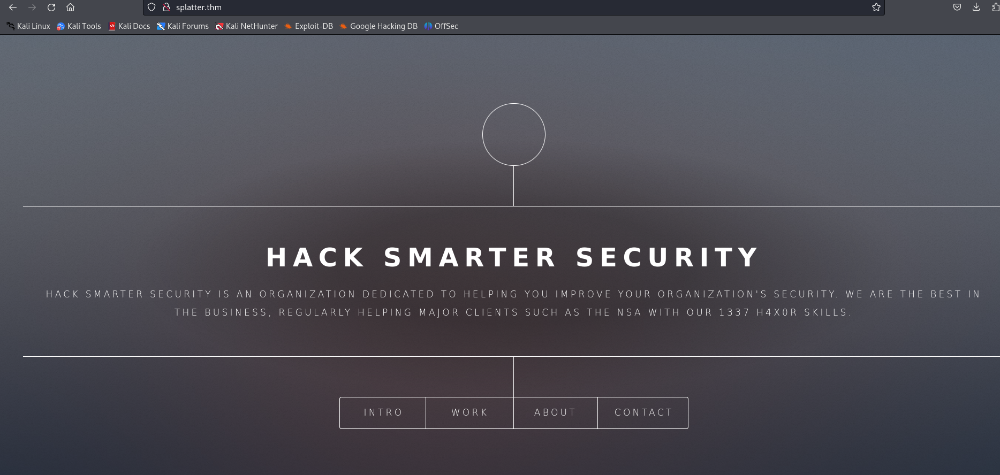
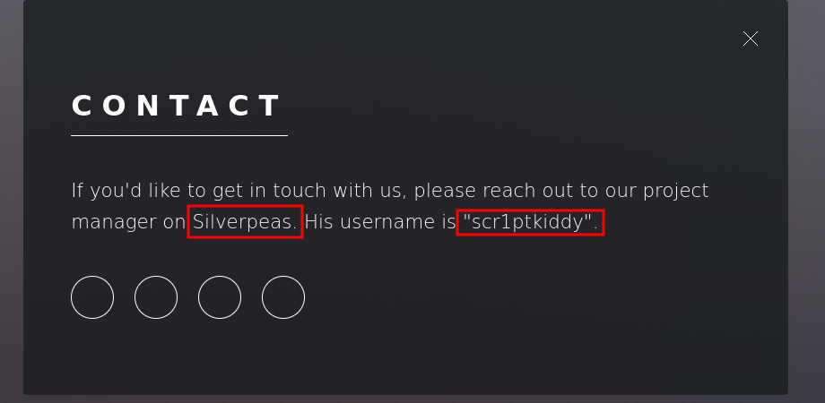
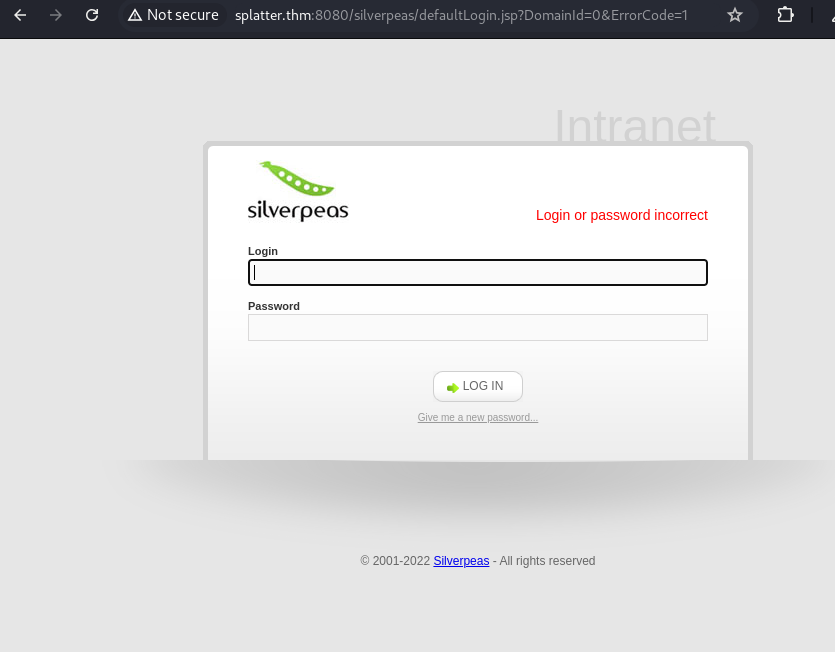
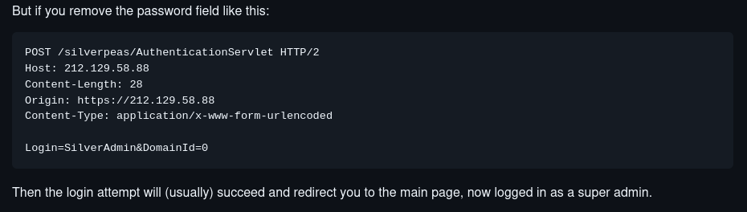
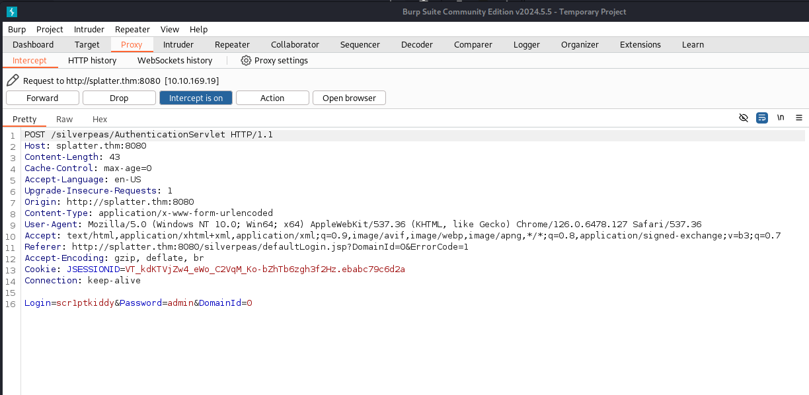
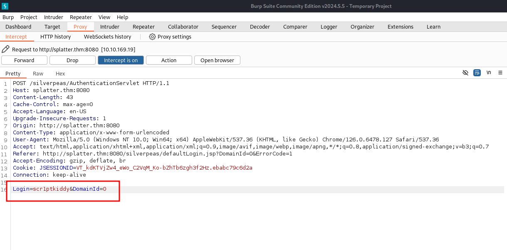
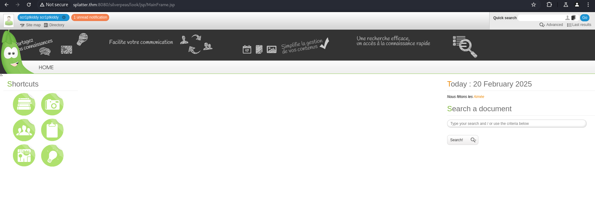
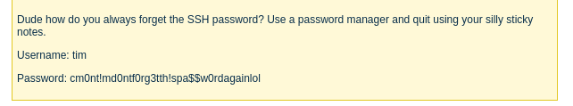
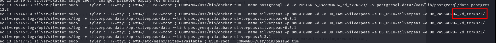

# Silver Platter
https://tryhackme.com/room/silverplatter

First of all I added the target IP address to `/etc/hosts` as `splatter.thm`

`nmap` scan:
```
sudo nmap --min-rate=10000 -p- splatter.thm
```
```
PORT     STATE SERVICE
22/tcp   open  ssh
80/tcp   open  http
8080/tcp open  http-proxy
```
```
sudo nmap -sC -sV -p22,80,8080 splatter.thm
```

Port 80 in web browser:



```
ffuf -w /usr/share/wordlists/seclists/Discovery/Web-Content/common.txt -u http://splatter.thm/FUZZ -c -t 300
```

If we go to contact, we can find some valuable information:


Going to `http://splatter.thm:8080/silverpeas` I found this:


I googled a little bit and found this:

Basically, it says, if I remove password from the request, it's going to log me in.

So I put in the username that I found earlier and using `BurpSuite` I looked at the request.


Then I removed the password from the request and got in.


One more helpful vulnerability:
https://github.com/RhinoSecurityLabs/CVEs/tree/master/CVE-2023-47323

Basicly, using next link we will be able to read all the messages we want to.
`http://splatter.thm:8080/silverpeas/RSILVERMAIL/jsp/ReadMessage.jsp?ID=[message-id]`
Going through messages one by one I found this:


Using the username and password, I got inside and immediately found the first flag.
```
ssh tim@splatter.thm
```

Looking around the machine I found out that there was another user called `tyler`. Reading auth log we can find his password.
```
cat /var/log/auth* | grep -i pass
```


The password was actually for database, but I tried and it worked for tyler.
_Zd_zx7N823/

Using `sudo su` and the password I got root and the second flag!