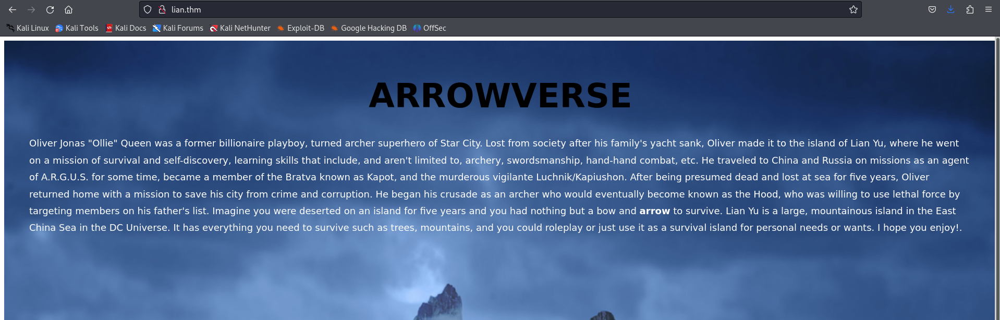
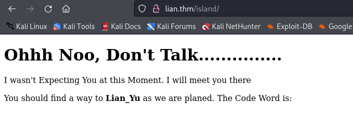
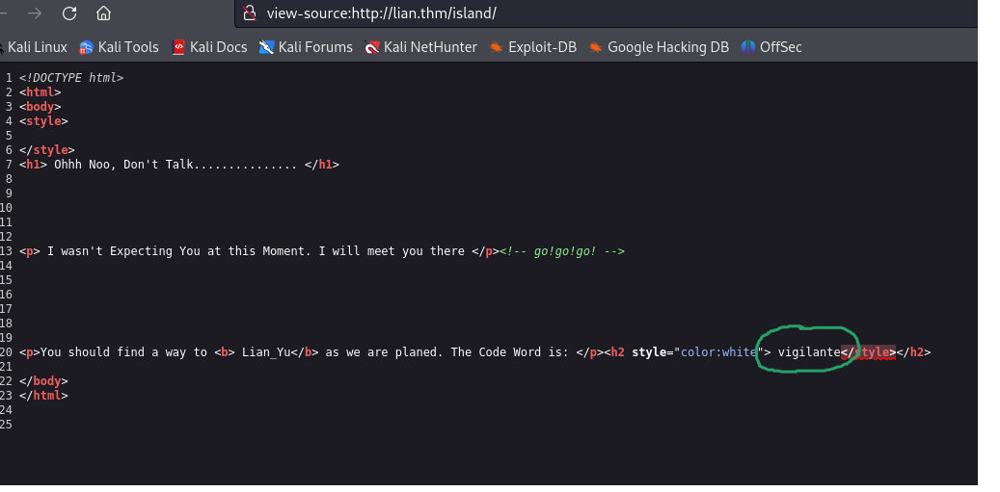

# Lian_Yu
http://lian.thm:<br>


Let's look at `nmap` scan.

**Nmap**
> **21** FTP<br>
> **22** SSH<br>
> **111** rpcbind<br>

Potential users:<br>
* Ollie
* Lian_Yu
<hr>

`fuff` found page **island** for me, here is what it looks like:<br>
```
ffuf -w /usr/share/wordlists/dirb/big.txt -u http://lian.thm/FUZZ -c
```
<br>
<br>

