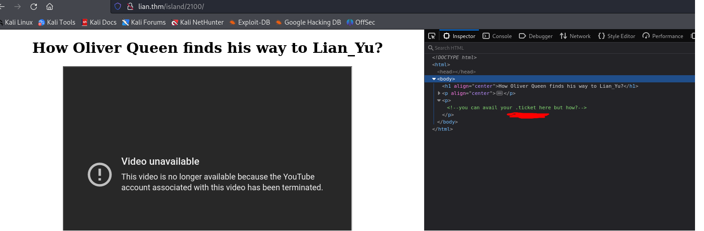
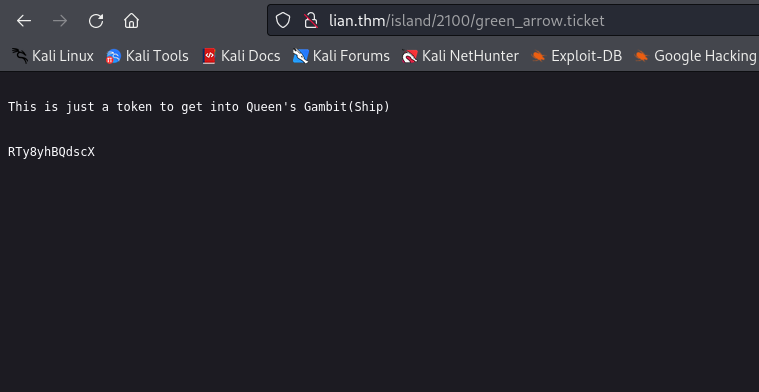

# Lian_Yu
http://lian.thm:<br>


Let's look at `nmap` scan.

**Nmap**
> **21** FTP<br>
> **22** SSH<br>
> **111** rpcbind<br>

Potential users:<br>
> Ollie<br>
> Lian_Yu<br>

`fuff` found page **island** for me, here is what it looks like:<br>

```
ffuf -w /usr/share/wordlists/dirb/big.txt -u http://lian.thm/FUZZ -c
```

<br>
<br>

Using `ffuf` we found http://lian.thm/island/2100/.<br>
 <br>

At this point we got a hint that we need to look for something with extension `.ticket`. And that is how we find http://lian.thm/island/2100/green_arrow.ticket.

<br>

I went to `CyberChef` tried to decode it from different encoders, but once I decoded it from `base58` it started looking like a password.

> `RTy8yhBQdscX` -> `!#th3h00d`.

Using username: `vigilante` and the password we could successfully `ftp`.<br>
Here is files that I got from the ftp server:<br>
> .other_user<br>
> Leave_me_alone.png<br>
> Queen's_Gambit.png<br>
> aa.jpg<br>

I did `binwalk` through the images, but it did not help. Then I did:

```
steghide info aa.jpg
```
it asked about a password so I did:
```
stegcracker aa.jpg
```
It made an archive for me. I extracted the archive and found there two files:<br>
> passwd.txt<br>
> shado<br>

There was nothing really interesting in the `passwd.txt` file, but the `shado` file had the password. Reading the `.other_user` file I assumed that the other username was `slade`. 

```
ssh slade@lian.thm
password: M3tahuman
```
<hr>

## Privilege Escalation
Then I did `sudo -l` and found:
```
User slade may run the following commands on LianYu:
    (root) PASSWD: /usr/bin/pkexec
```

I went to https://gtfobins.github.io and found this command:
```
sudo pkexec /bin/sh
```
And that is how I got **root**.
