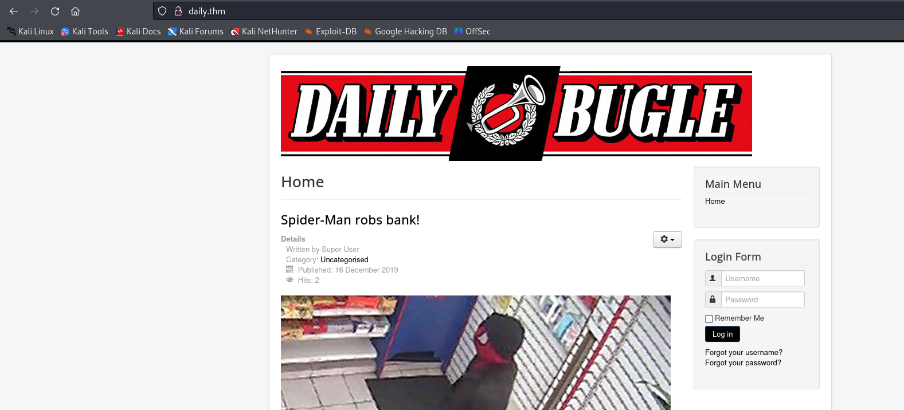
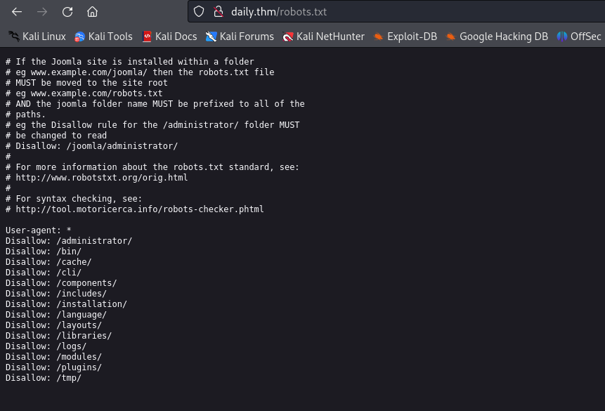
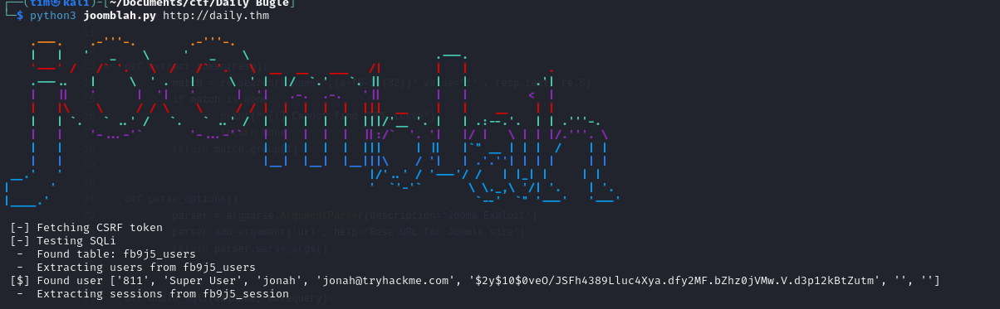
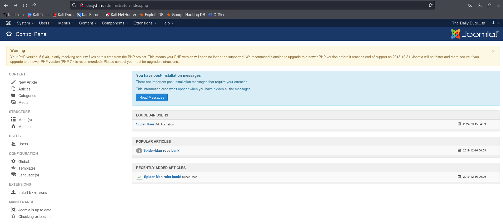

# Daily Bugle




Looks like it is running joomla. I used Joomscan and found that the joomla version is 3.7.0. Googled for an exploit and found something.

So I found the python scritp and ran it.
```
python3 joomblah.py http://daily.thm
```
Here is the output:

```
...
[$] Found user ['811', 'Super User', 'jonah', 'jonah@tryhackme.com', '$2y$10$0veO/JSFh4389Lluc4Xya.dfy2MF.bZhz0jVMw.V.d3p12kBtZutm', '', '']
...
```

Using `john` I cracked the hash and the password is: `spiderman123`<br
Using those creds I logged in to joomla admin panel


Then I edited one of the template's `index.php` file and got a reverse-shell.
Then, in the folder of the site I found file called `configuration.php`. Reading this I found some credentials. I tried using these creds to switch to the user in the `/home` directory and that was successful. <br>

```
sudo -l
```
And then: https://gtfobins.github.io/gtfobins/yum/#sudo