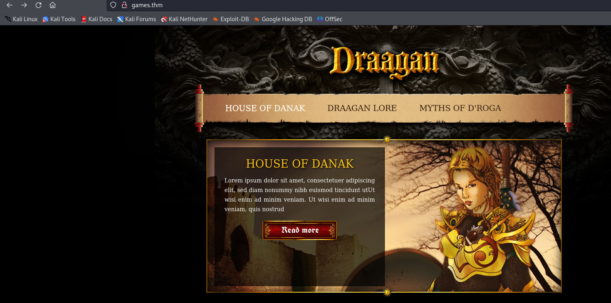
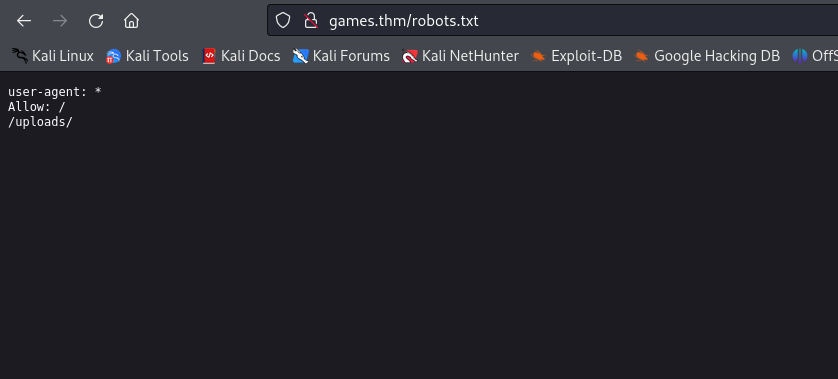
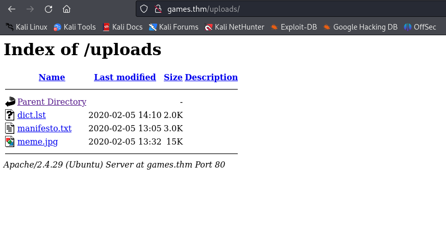
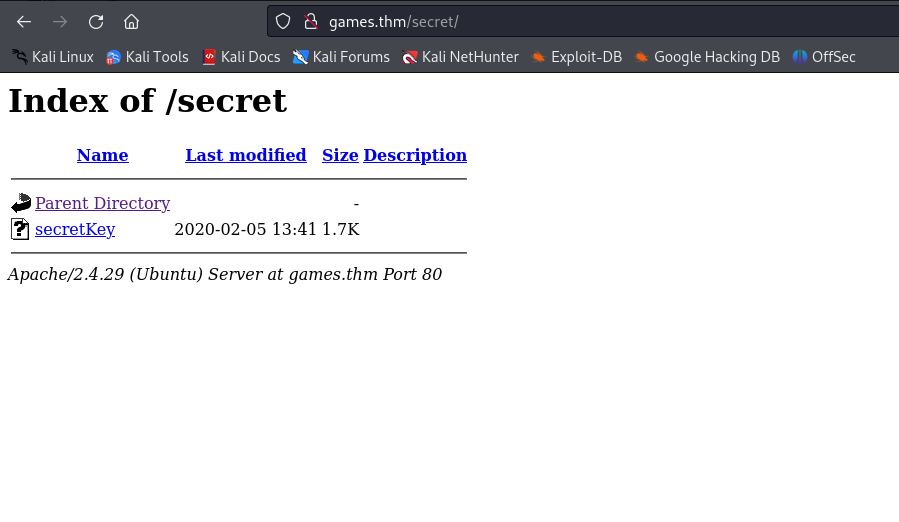
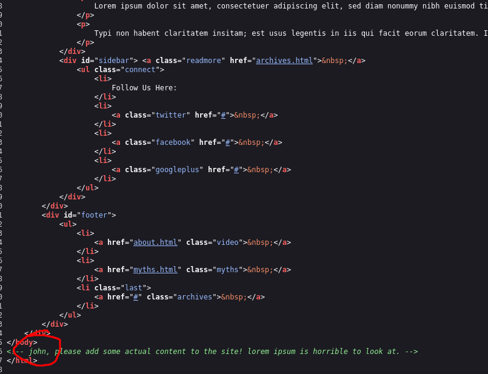
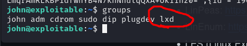

# Gaming Server
 
 
 
 
I got the `secretKey` file and cracked it. The passphrase is: 
`lemein` 

Also we got user `john` 
 

I executed `groups` command and found this: 
 
Than I used this tutorial: https://book.hacktricks.xyz/linux-hardening/privilege-escalation/interesting-groups-linux-pe/lxd-privilege-escalation