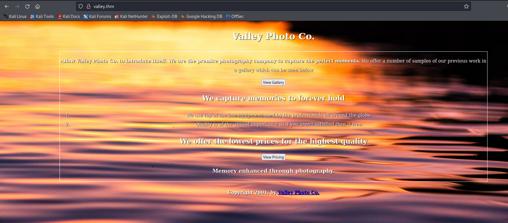

# Valley

We got a website on vally.thm port 80<br>
<br>

usernames:<br>
valleyDev<br>

```
dev notes from valleyDev:
-add wedding photo examples
-redo the editing on #4
-remove /dev1243224123123
-check for SIEM alerts
```

```
loginButton.addEventListener("click", (e) => {
    e.preventDefault();
    const username = loginForm.username.value;
    const password = loginForm.password.value;

    if (username === "siemDev" && password === "california") {
        window.location.href = "/dev1243224123123/devNotes37370.txt";
    } else {
        loginErrorMsg.style.opacity = 1;
    }
})

siemDev:california
```

```
dev notes for ftp server:
-stop reusing credentials
-check for any vulnerabilies
-stay up to date on patching
-change ftp port to normal port
```

ftp port = 37370/tcp

```
uname=valleyDev&psw=ph0t0s1234&remember=onHTTP/1.1 200 OK
valleyDev:ph0t0s1234
```

```
const users = {
  "john": {
    username: "john",
    password: "replace",
    email: "john@example.com",
    age: 25,
    country: "USA"
  },
  "jane": {
    username: "jane",
    password: "replace",
    email: "jane@example.com",
    age: 30,
    country: "Canada"
  },
  "bob": {
    username: "bob",
    password: "replace",
    email: "bob@example.com",
    age: 40,
    country: "UK"
  }
};
```