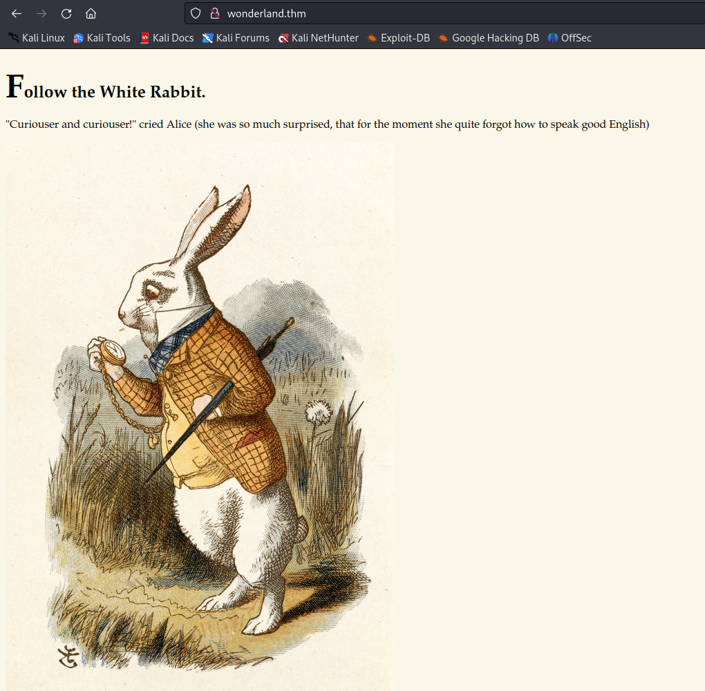
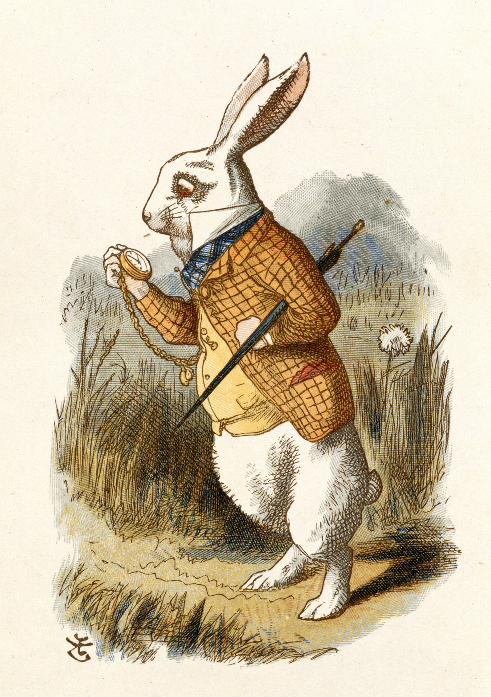
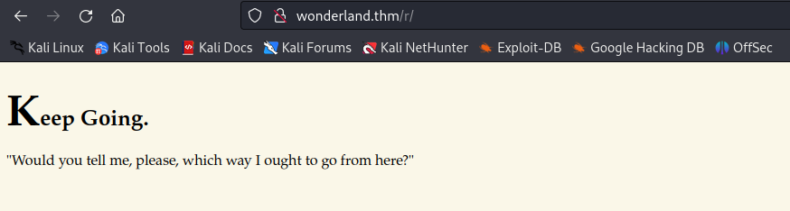
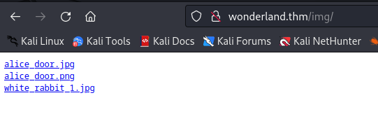
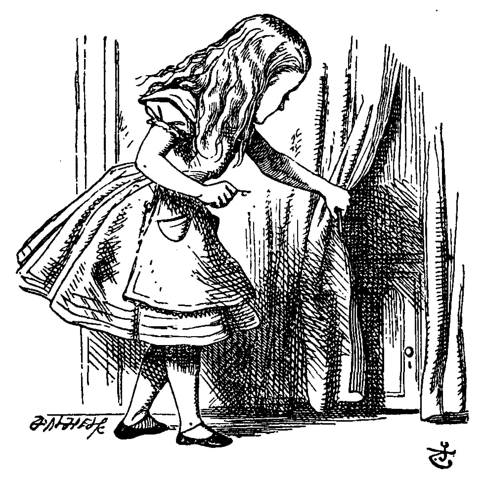
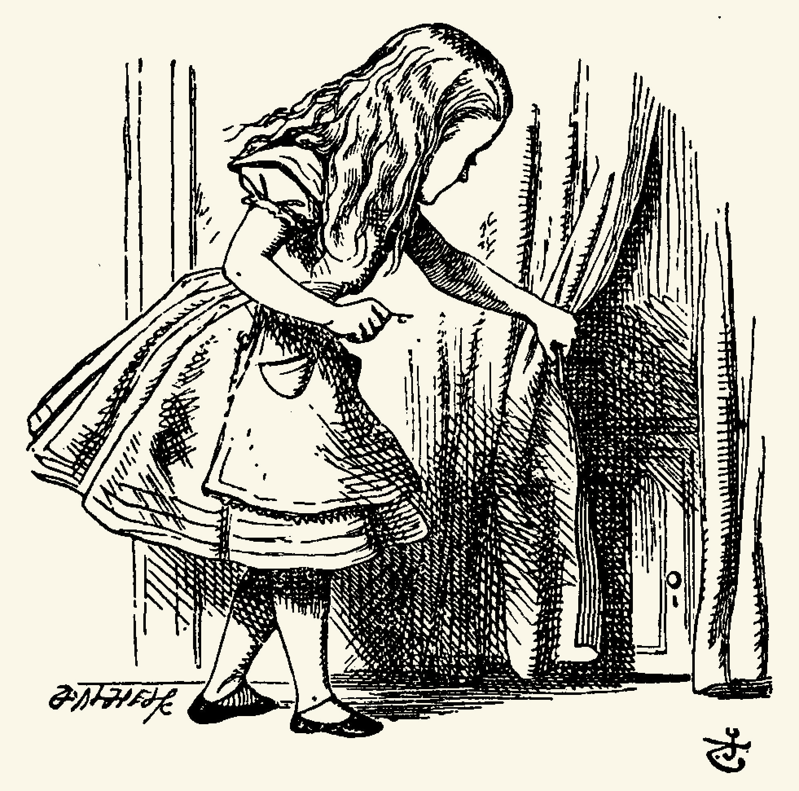
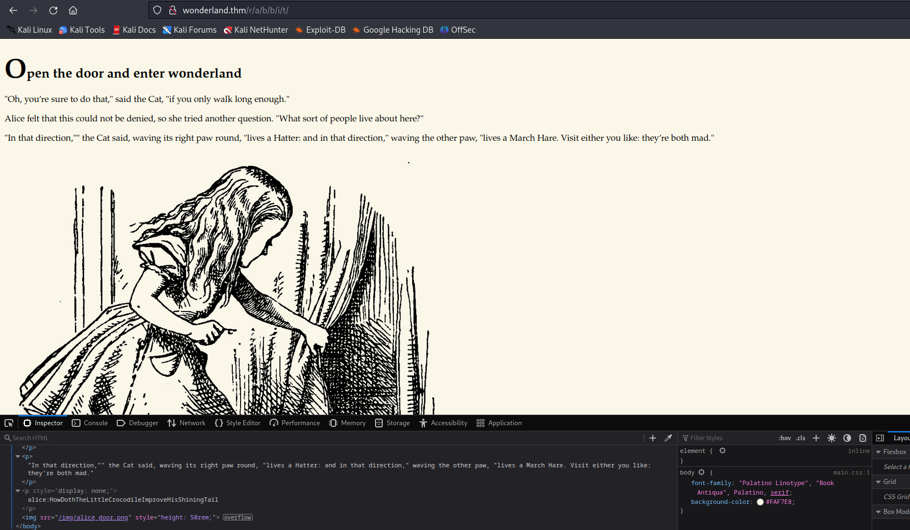

# Wonderland

First of all I added the *wonderland.thm* to `/etc/hosts` and I am going to use it instead of the IP. <br>
Here is what we got from **nmap** scan:
```nmap
PORT   STATE SERVICE VERSION
22/tcp open  ssh     OpenSSH 7.6p1 Ubuntu 4ubuntu0.3 (Ubuntu Linux; protocol 2.0)
| ssh-hostkey: 
|   2048 8eeefb96cead70dd05a93b0db071b863 (RSA)
|   256 7a927944164f204350a9a847e2c2be84 (ECDSA)
|_  256 000b8044e63d4b6947922c55147e2ac9 (ED25519)
80/tcp open  http    Golang net/http server (Go-IPFS json-rpc or InfluxDB API)
|_http-title: Follow the white rabbit.
Service Info: OS: Linux; CPE: cpe:/o:linux:linux_kernel
```
Let's look at the http server using web browser.<br>
<br>
Let's download the image and look if there is anything interesting.<br>
<br>
Here is the image.
Looks like we can extract something from there using steghide, but we need the password. Let's try to crack it.
Probably there is no sense to crack it. I got a message there like this: 
`follow the r a b b i t` what does it mean?
Let's do **gobuster** to the http server.<br>

Things are getting interesting. Using **gobuster** we found 3 new paths.
```gobuster
/img                  (Status: 301) [Size: 0] [--> img/]
/index.html           (Status: 301) [Size: 0] [--> ./]
/r                    (Status: 301) [Size: 0] [--> r/]
```

**r** page:<br>


**img** page:<br>
<br>
We got to more images there. Let's download and inspect them.<br>
 <br>
Using binwalk we found that there is something in the **alice_door.png**. Let's extract it. Looks like there is nothing interesting.
Now I am going to look at the jpg image. Well, still nothing interesting.
We could try to do gobuster few more times and we can get to the *http://wonderland.thm/r/a/b/b/i/t*
We got this page:<br>
<br>
And this interesting little string: `alice:HowDothTheLittleCrocodileImproveHisShiningTail`
Those were credentials that let us into ssh. 